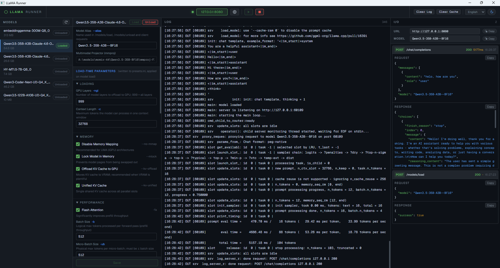

# LLaMA Runner

[English](README.md) · [简体中文](README.zh-CN.md)

A lightweight desktop GUI for managing and interacting with [llama.cpp](https://github.com/ggml-org/llama.cpp)'s `llama-server` in multi-model routing mode.

> **Note:** This project is not affiliated with or endorsed by Meta.

---

## Table of Contents

- [Features](#features)
- [Requirements](#requirements)
- [Getting Started](#getting-started)
- [Configuration](#configuration)
- [Building from Source](#building-from-source)
- [Platform Notes](#platform-notes)
- [License](#license)

---

## Features

- **One-click service control** — start and stop `llama-server` from the toolbar; all child processes are cleaned up automatically on exit.
- **Model directory scanning** — point to a folder; the app recursively discovers all `.gguf` files, including multi-shard and multimodal (mmproj) models.
- **Per-model configuration** — GPU layers, context size, KV cache type, batch sizes, parallel slots, flash attention, reasoning format, sampling defaults, and more — all written to `presets.ini` and applied on model load.
- **Load / Unload models at runtime** via `llama-server`'s `/models/load` and `/models/unload` endpoints.
- **Transparent reverse proxy** — the app proxies all traffic through the configured port, recording every request and response in the I/O panel.
- **I/O panel** — syntax-highlighted JSON, copyable request/response bodies.
- **Service info bar** — one-click copy of the server URL and current model alias.
- **Internationalisation** — UI language is driven by `ui/i18n/langs.json`; add new languages without recompiling.
- **Light / dark theme** — toggled via the toolbar moon/sun button; preference persisted to `localStorage`.
- **Windows Job Object** — on Windows, `llama-server` is placed in a Job Object with `KILL_ON_JOB_CLOSE`; it is terminated automatically even on an abnormal parent exit.

---

## Screenshot



---

## Requirements

### Runtime

| Component | Details |
|-----------|---------|
| **llama-server** | Any recent build of [llama.cpp](https://github.com/ggml-org/llama.cpp). Place the binary (and its DLLs on Windows) inside the `lib/` folder next to the executable. |
| **WebView2** (Windows only) | Included with Windows 11 and Edge ≥ 87. [Download runtime](https://developer.microsoft.com/en-us/microsoft-edge/webview2/). |
| **WebKit2GTK** (Linux only) | `libwebkit2gtk-4.0` or `libwebkit2gtk-4.1`. Install via your package manager (see [Platform Notes](#platform-notes)). |

### Build

| Tool | Version | Notes |
|------|---------|-------|
| Go | 1.21+ | <https://go.dev/dl/> |
| C/C++ compiler | any supporting C++11 | CGO is required by the webview bindings |
| **Windows** | TDM-GCC or MSYS2 mingw64 | `windres` (included) is used to embed the icon |
| **macOS** | Xcode Command Line Tools | `xcode-select --install` |
| **Linux** | gcc + GTK3 + WebKit2GTK dev headers | See [Platform Notes](#platform-notes) |

---

## Getting Started

1. **Download or build** the binary for your platform (see [Building from Source](#building-from-source)).
2. Create a `lib/` folder next to the executable (or `.app` bundle on macOS).
3. Place `llama-server` (+ DLLs on Windows) inside `lib/`.
4. Launch `llama-runner`.
5. Click ⚙ **Settings** and select your **Models Directory**.
6. Click **▶** to start the service.
7. Select a model in the left panel, configure parameters, and click **Load**.
8. Point your OpenAI-compatible client to `http://127.0.0.1:8080` (or the port you configured).

---

## Configuration

All configuration is stored in the `configs/` folder next to the executable.

| File | Description |
|------|-------------|
| `configs/app_settings.json` | Service host, port, models directory, environment variables. |
| `configs/presets.ini` | Auto-generated on every save; passed to `llama-server --models-preset`. |
| `configs/model_params/<id>.json` | Per-model parameter overrides. |
| `ui/i18n/langs.json` | Language menu entries. Add `"<Display Name>": "<locale>"` and create `ui/i18n/<locale>.json` to add a new language. |

### Adding a language

1. Copy `ui/i18n/en_us.json` to `ui/i18n/<locale>.json`.
2. Translate the values (keep all keys unchanged).
3. Add an entry to `ui/i18n/langs.json`: `"<Display Name>": "<locale>"`.
4. The language selector updates automatically — **no rebuild required**.

---

## Building from Source

### Windows

```bat
build.bat
```

Requires `windres` (from TDM-GCC or MSYS2 mingw64) on `PATH` to embed the application icon. If `windres` is not found the icon is skipped and the build continues.

**Install TDM-GCC:** <https://jmeubank.github.io/tdm-gcc/>  
**Install MSYS2:** <https://www.msys2.org/> → `pacman -S mingw-w64-x86_64-gcc`

### macOS

```bash
./build_unix.sh
```

Produces a `llama-runner.app` bundle. Launch it with:

```bash
open llama-runner.app
```

Place the `llama-server` binary (no extension) in `lib/` next to the `.app` bundle.

### Linux

Install the required headers first (see [Platform Notes → Linux](#linux)), then:

```bash
./build_unix.sh
```

Produces `llama-runner-linux-amd64` (or `arm64`). Place `llama-server` in `lib/` next to the binary.

---

## Platform Notes

### Windows

- Tested on Windows 10 22H2 and Windows 11.
- Requires [WebView2 Runtime](https://developer.microsoft.com/en-us/microsoft-edge/webview2/) (bundled with Windows 11 and modern Edge).
- `llama-server.exe` and its companion DLLs must be placed in the `lib/` folder.

### macOS

- Requires Xcode Command Line Tools (`xcode-select --install`).
- The webview uses `WKWebView` via [webview/webview_go](https://github.com/webview/webview_go).
- The app **must** run from inside an `.app` bundle — `build_unix.sh` creates this automatically.
- Place the `llama-server` binary (no extension) in `lib/` next to the `.app` bundle.

### Linux

Install GTK3 and WebKit2GTK development headers before building:

```bash
# Ubuntu / Debian (22.04 and earlier)
sudo apt install libgtk-3-dev libwebkit2gtk-4.0-dev

# Ubuntu 23.04+ / Debian 12+
sudo apt install libgtk-3-dev libwebkit2gtk-4.1-dev

# Fedora
sudo dnf install gtk3-devel webkit2gtk4.0-devel

# Arch Linux
sudo pacman -S webkit2gtk

# openSUSE
sudo zypper install gtk3-devel webkit2gtk3-devel
```

The compiled binary links against GTK3 and WebKit2GTK at runtime; include these packages as dependencies when distributing in `.deb` or `.rpm` format.

---

## License

[MIT](LICENSE) — see the [LICENSE](LICENSE) file for details.
