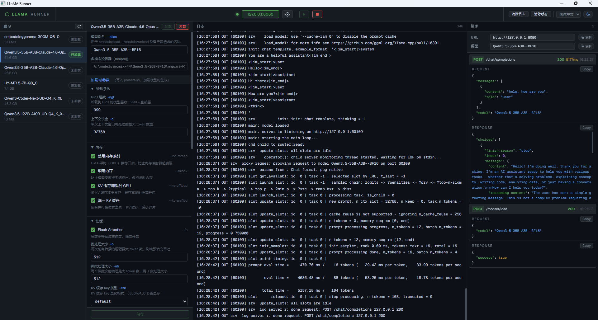

# LLaMA Runner

[English](README.md) · [简体中文](README.zh-CN.md)

基于 [llama.cpp](https://github.com/ggml-org/llama.cpp) `llama-server` 多模型路由模式的轻量级桌面 GUI 管理工具。

> **声明：** 本项目与 Meta 公司无关，也未获得 Meta 的背书。

---

## 目录

- [功能特性](#功能特性)
- [环境要求](#环境要求)
- [快速开始](#快速开始)
- [配置说明](#配置说明)
- [从源码构建](#从源码构建)
- [平台说明](#平台说明)
- [开源许可](#开源许可)

---

## 功能特性

- **一键服务控制** — 从工具栏启动/停止 `llama-server`，程序退出时自动清理所有子进程。
- **模型目录扫描** — 指定目录后递归发现所有 `.gguf` 文件，支持多分片模型及多模态（mmproj）模型。
- **模型参数配置** — GPU 层数、上下文长度、KV 缓存类型、批处理大小、并行槽位、Flash Attention、推理格式、采样默认值等，全部写入 `presets.ini`，加载模型时自动生效。
- **运行时加载/卸载模型** — 通过 `llama-server` 的 `/models/load` 和 `/models/unload` 接口实现。
- **透明反向代理** — 所有流量经过配置端口代理并转发，每条请求和响应均记录在 I/O 面板。
- **I/O 面板** — JSON 语法高亮，请求/响应内容可一键复制。
- **服务信息栏** — 一键复制服务器地址及当前模型别名。
- **国际化支持** — 语言列表由 `ui/i18n/langs.json` 驱动，无需重新编译即可添加新语言。
- **明暗主题切换** — 通过工具栏月亮/太阳按钮切换，偏好持久化至 `localStorage`。
- **Windows Job Object** — Windows 平台将 `llama-server` 加入 Job Object 并设置 `KILL_ON_JOB_CLOSE`，即使主进程异常退出也会自动终止子进程。

---

## 界面预览



---

## 环境要求

### 运行时

| 组件 | 说明 |
|------|------|
| **llama-server** | 任意近期构建的 [llama.cpp](https://github.com/ggml-org/llama.cpp)。将二进制（Windows 还需 DLL）放入可执行文件旁的 `lib/` 目录。 |
| **WebView2**（仅 Windows） | Windows 11 和 Edge ≥ 87 已内置。[下载运行时](https://developer.microsoft.com/zh-cn/microsoft-edge/webview2/)。 |
| **WebKit2GTK**（仅 Linux） | `libwebkit2gtk-4.0` 或 `libwebkit2gtk-4.1`，通过包管理器安装（参见[平台说明](#平台说明)）。 |

### 构建

| 工具 | 版本 | 备注 |
|------|------|------|
| Go | 1.21+ | <https://go.dev/dl/> |
| C/C++ 编译器 | 支持 C++11 即可 | webview 绑定依赖 CGO |
| **Windows** | TDM-GCC 或 MSYS2 mingw64 | 内含 `windres`，用于嵌入图标 |
| **macOS** | Xcode 命令行工具 | `xcode-select --install` |
| **Linux** | gcc + GTK3 + WebKit2GTK 开发头文件 | 参见[平台说明 → Linux](#linux-1) |

---

## 快速开始

1. **下载或构建**对应平台的二进制文件（参见[从源码构建](#从源码构建)）。
2. 在可执行文件旁（macOS 为 `.app` 包旁）创建 `lib/` 目录。
3. 将 `llama-server`（Windows 还需 DLL）放入 `lib/`。
4. 启动 `llama-runner`。
5. 点击 ⚙ **设置**，选择**模型目录**。
6. 点击 **▶** 启动服务。
7. 在左侧面板选择模型，配置参数后点击**加载**。
8. 将 OpenAI 兼容客户端的 baseURL 指向 `http://127.0.0.1:8080`（或你配置的端口）。

---

## 配置说明

所有配置存储在可执行文件旁的 `configs/` 目录。

| 文件 | 说明 |
|------|------|
| `configs/app_settings.json` | 服务监听地址、端口、模型目录、环境变量。 |
| `configs/presets.ini` | 每次保存时自动生成，通过 `llama-server --models-preset` 传入。 |
| `configs/model_params/<id>.json` | 单个模型的参数覆盖配置。 |
| `ui/i18n/langs.json` | 语言菜单项。添加 `"<显示名称>": "<locale>"` 并创建 `ui/i18n/<locale>.json` 即可增加新语言。 |

### 添加语言

1. 复制 `ui/i18n/en_us.json` 为 `ui/i18n/<locale>.json`。
2. 翻译所有键值（保持键名不变）。
3. 在 `ui/i18n/langs.json` 添加条目：`"<显示名称>": "<locale>"`。
4. 语言选择器自动更新，**无需重新编译**。

---

## 从源码构建

### Windows

```bat
build.bat
```

需要 `windres`（来自 TDM-GCC 或 MSYS2 mingw64）在 `PATH` 中以嵌入图标。若未找到 `windres`，将跳过图标并继续构建。

**安装 TDM-GCC：** <https://jmeubank.github.io/tdm-gcc/>  
**安装 MSYS2：** <https://www.msys2.org/> → `pacman -S mingw-w64-x86_64-gcc`

### macOS

```bash
./build_unix.sh
```

自动生成 `llama-runner.app` 应用包。启动方式：

```bash
open llama-runner.app
```

将 `llama-server` 二进制（无扩展名）放在 `.app` 包旁的 `lib/` 目录。

### Linux

先安装依赖头文件（参见[平台说明 → Linux](#linux-1)），然后执行：

```bash
./build_unix.sh
```

输出文件为 `llama-runner-linux-amd64`（或 `arm64`）。将 `llama-server` 放在 `lib/` 目录。

---

## 平台说明

### Windows

- 已在 Windows 10 22H2 和 Windows 11 上测试。
- 需要 [WebView2 运行时](https://developer.microsoft.com/zh-cn/microsoft-edge/webview2/)（Windows 11 / 现代 Edge 已内置）。
- `llama-server.exe` 及其 DLL 须放在 `lib/` 目录。

### macOS

- 需要 Xcode 命令行工具（`xcode-select --install`）。
- Webview 使用 `WKWebView`，通过 [webview/webview_go](https://github.com/webview/webview_go) 绑定。
- 应用**必须**运行于 `.app` 包内，`build_unix.sh` 已自动处理。
- 将 `llama-server` 二进制（无扩展名）放在 `.app` 包旁的 `lib/`。

### Linux

构建前安装 GTK3 及 WebKit2GTK 开发头文件：

```bash
# Ubuntu / Debian 22.04 及更早
sudo apt install libgtk-3-dev libwebkit2gtk-4.0-dev

# Ubuntu 23.04+ / Debian 12+
sudo apt install libgtk-3-dev libwebkit2gtk-4.1-dev

# Fedora
sudo dnf install gtk3-devel webkit2gtk4.0-devel

# Arch Linux
sudo pacman -S webkit2gtk

# openSUSE
sudo zypper install gtk3-devel webkit2gtk3-devel
```

编译后的二进制在运行时动态链接 GTK3 和 WebKit2GTK；以 `.deb` 或 `.rpm` 格式分发时请将这些库列为依赖项。

---

## 开源许可

[MIT](LICENSE) — 详见 [LICENSE](LICENSE) 文件。
